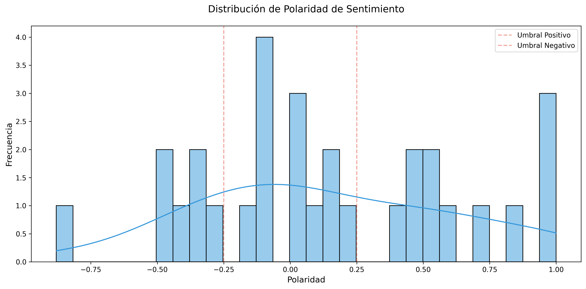
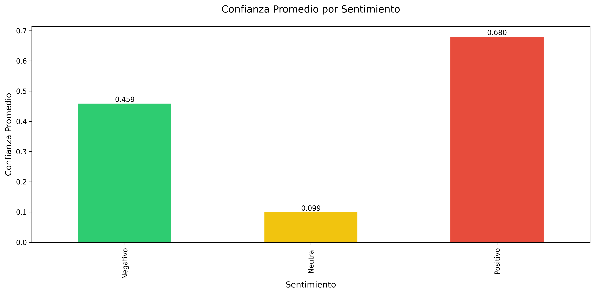

# Sentiment Analyzer

Welcome! 😊 This project was crafted with care to help you understand the emotions behind text—especially in the world of hospitality and travel. Here, we don't just analyze data, we discover stories and feelings!

---

## 🎯 Who is this tool for?

If you work in hotels, travel agencies, restaurants, customer service, or you're simply passionate about understanding your customers, this project is for you. Analyze reviews, comments, and feedback in a simple and visual way.

---

## 🌟 What can you do here?

- Analyze sentiment in real time with a friendly web interface.
- Process single texts or large batches of reviews.
- Get polarity scores and sentiment labels (Positive, Negative, Neutral).
- Visualize results and charts to make better decisions.

---

## 🛠️ Technologies we love

- Python 3.x
- TextBlob for natural language processing
- Streamlit for the web interface
- Pandas and Scikit-learn for data handling and machine learning

---

## 📋 What do you need before starting?

- Python 3.x installed
- pip (Python package manager)

---

## 🚀 Get started in minutes!

1. Clone this repository:
```bash
git clone https://github.com/RanuK12/sentiment-analyzer.git
cd sentiment-analyzer
```
2. Install the dependencies:
```bash
pip install -r requirements.txt
```

---

## 💻 How do I use it?

1. Run the Streamlit app:
```bash
streamlit run streamlit_app.py
```
2. Open your browser and go to the URL shown in the terminal (usually http://localhost:8501)
3. Type your text and discover the feeling behind the words!

---

## 📊 How does it work under the hood?

We use TextBlob and a special touch of domain keywords to analyze each text. We calculate polarity (from -1 to 1) and classify the sentiment:
- Positive (polarity > 0.1)
- Negative (polarity < -0.1)
- Neutral (between -0.1 and 0.1)

---

## 💼 Real-world use cases

### Hotels and booking platforms
- Discover what your guests love (and what they don't)
- Spot trends and improve your service

### Travel agencies
- Evaluate destinations and providers
- Enhance your clients' experience

### Restaurants and hospitality
- Monitor reviews and comments
- Identify opportunities for improvement

---

## 🤝 Collaborate and make it yours!

Have ideas, suggestions, or want to contribute? You're more than welcome! Fork the repo, open an issue, or send a pull request. This project grows with you.

---

## 📝 License

MIT License. Use it, share it, and make it better.

---

## 👥 Author

- **RanuK12** - [GitHub Profile](https://github.com/RanuK12)

---

## 🙏 Acknowledgments

- To the open source community for inspiring and sharing.
- To TextBlob and Streamlit for making sentiment analysis accessible to everyone.

---

## Visual examples of results

Here are some charts automatically generated when evaluating the model with real reviews:

### Confusion Matrix


### Predicted Sentiment Distribution


### Polarity Distribution



### Average Confidence by Sentiment



These charts help you visualize the robustness and behavior of the model in real-world scenarios. I hope you find them useful!